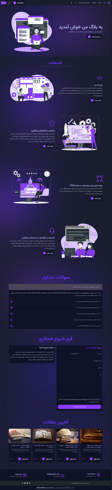
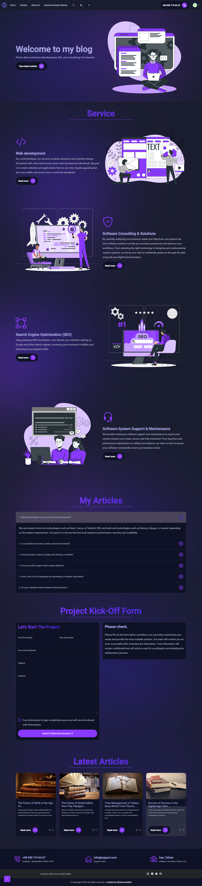
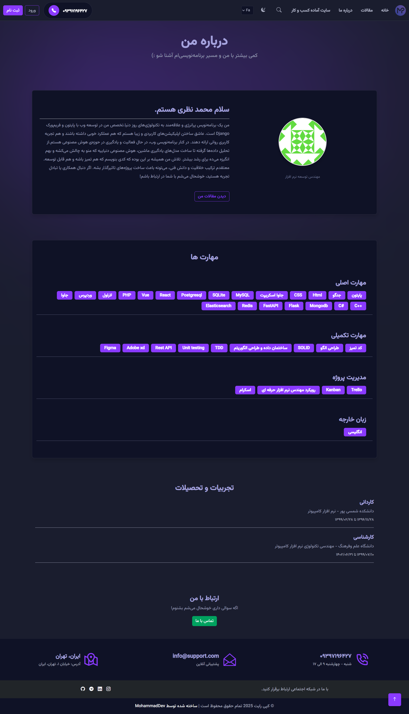
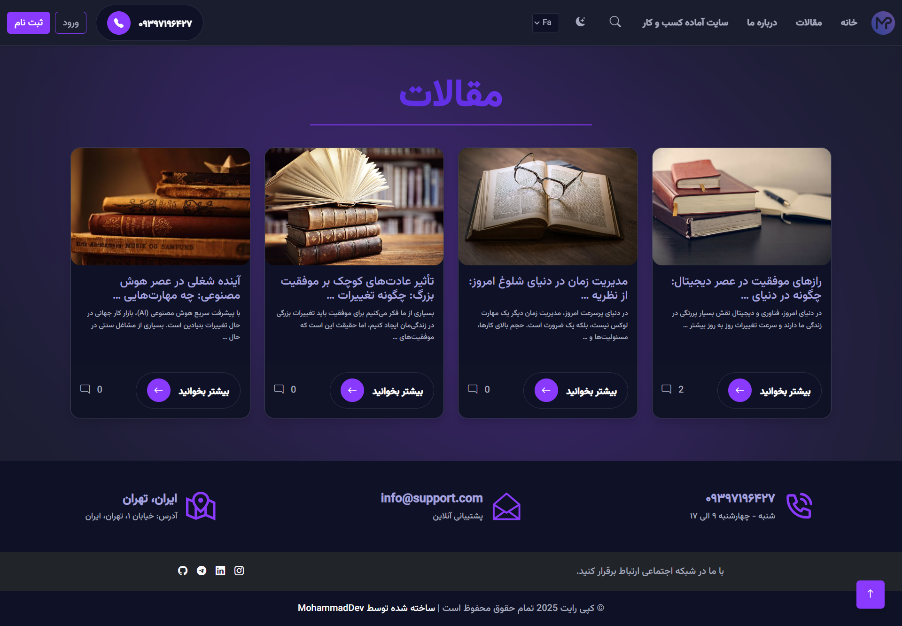
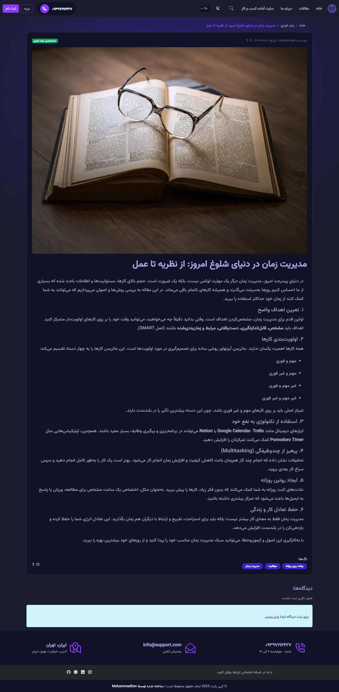
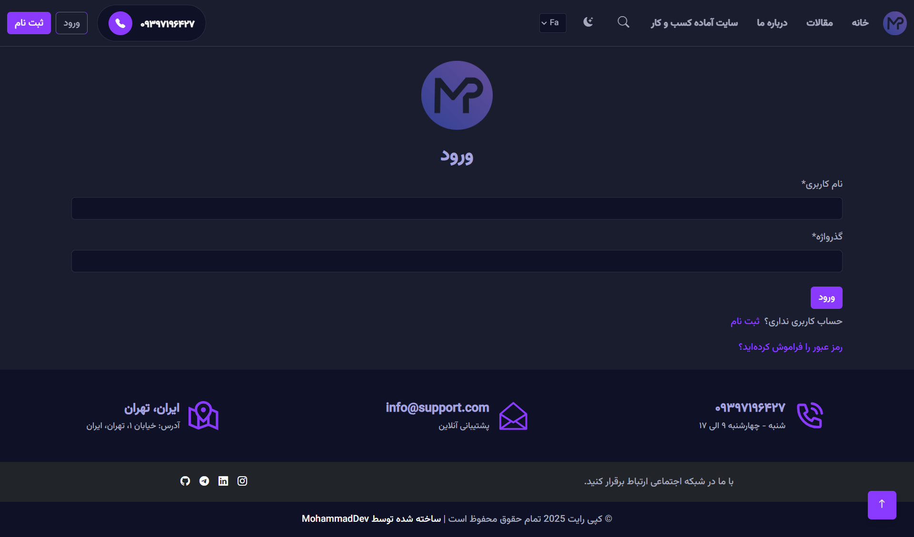
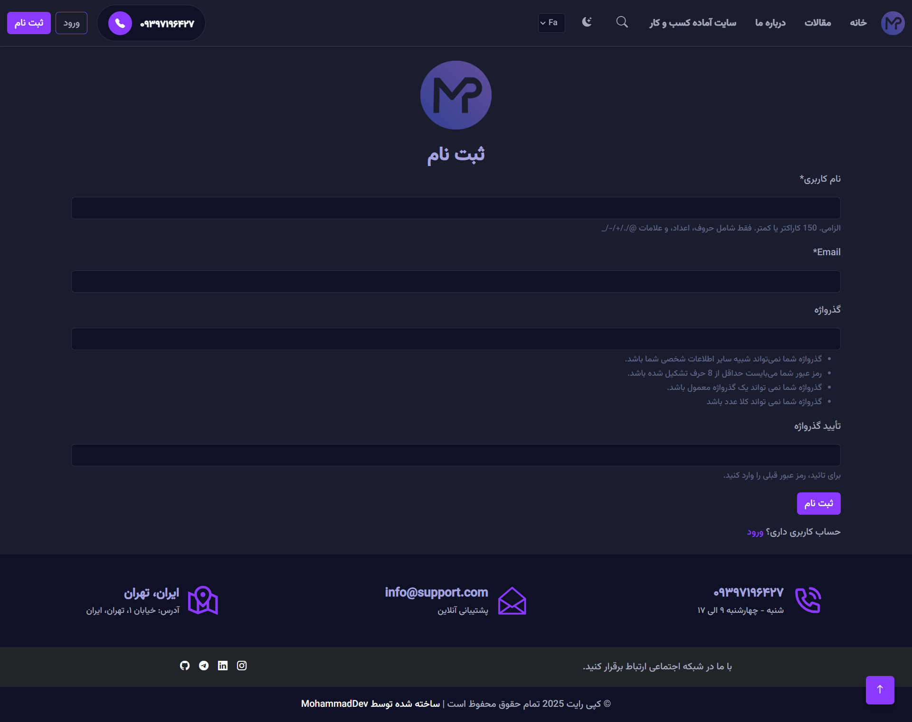

# 🌐 نمونه‌کارهای وب من – MyPortfolio

سلام! 👋  
من **محمد** هستم، توسعه‌دهنده وب با تجربه در طراحی و پیاده‌سازی پروژه‌های سمت سرور و رابط کاربری.  
در این پورتفولیو می‌توانید نمونه‌ای از پروژه‌ها و اسکرین‌شات‌های من را مشاهده کنید.  
سورس‌کد پروژه‌ها به‌صورت خصوصی نگهداری می‌شود و تنها ظاهر و طراحی پروژه‌ها برای نمایش قرار داده شده است.

---

## 🧩 پروژه‌ها

### 1️⃣ وب‌سایت صفحه اصلی  
**تکنولوژی‌ها:** Django, Python, Bootstrap 5, SCSS, HTML, JavaScript, PostgreSQL, Redis, Elasticsearch

- **توضیح:** صفحه اصلی وب‌سایت شخصی که اطلاعات کاربر را با طراحی مدرن و واکنش‌گرا نمایش می‌دهد.

- **توضیح:** نسخه انگلیسی صفحه اصلی برای کاربران بین‌المللی.

---

### 2️⃣ صفحه "درباره ما"  
- **توضیح:** در این صفحه اطلاعات مربوط به کسب‌وکار، مهارت‌های فنی و مدیریت پروژه ارائه شده است.

---

### 3️⃣ بخش مقالات  
- **توضیح:** امکان مشاهده فهرست مقالات و خواندن محتوای هر مقاله با طراحی گرافیکی جذاب.
- 

---

### 4️⃣ صفحات احراز هویت  
- **توضیح:** نمونه طراحی صفحات ورود و ثبت‌نام با طراحی ساده و کاربردی.
- 

---

## 💡 درباره من  
- 💻 تخصص: توسعه وب (Backend و Frontend)  
- ⚙️ ابزارها: VS Code, Git, GitHub  
- 🎯 علاقه‌مند به طراحی رابط کاربری و تجربه کاربری (UI/UX)

---

## 📫 راه‌های ارتباطی  
- [GitHub](https://github.com/MohammadNazari98)  
- [ایمیل](mailto:www.mohamadnazari771998@gmail.com)

---

> ⚠️ **توجه:** سورس‌کد پروژه‌ها خصوصی است و صرفاً تصاویر و نمای طراحی برای مشاهده قرار داده شده‌اند.
